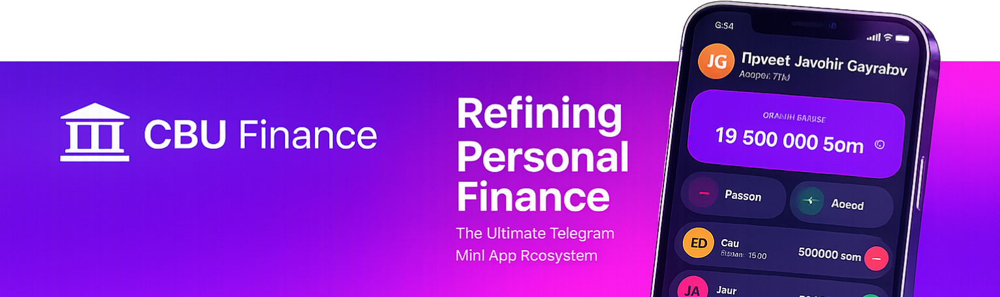
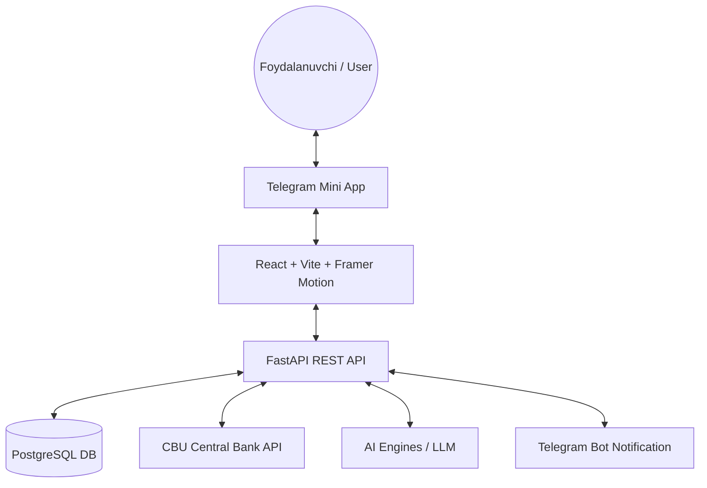
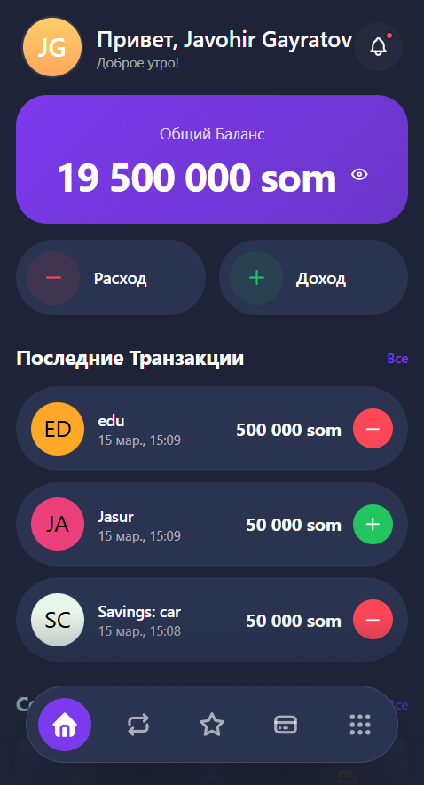
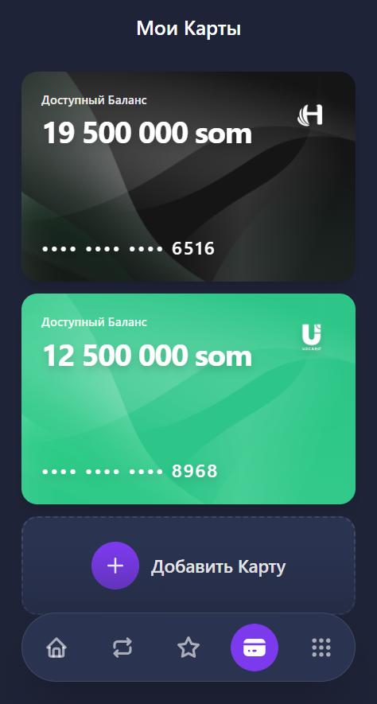
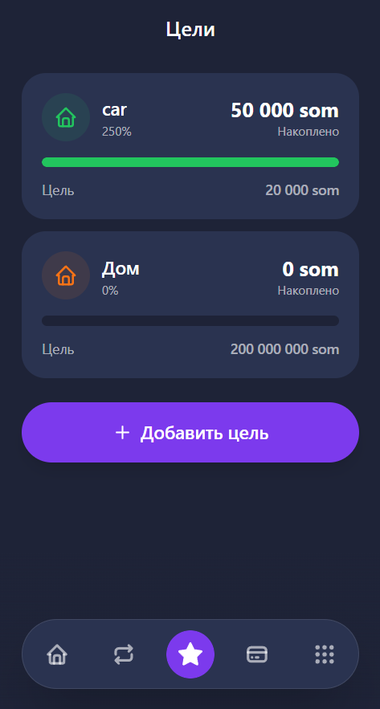
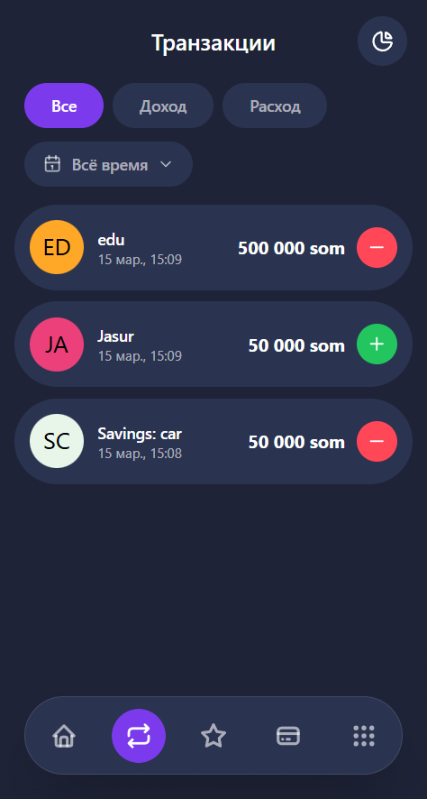
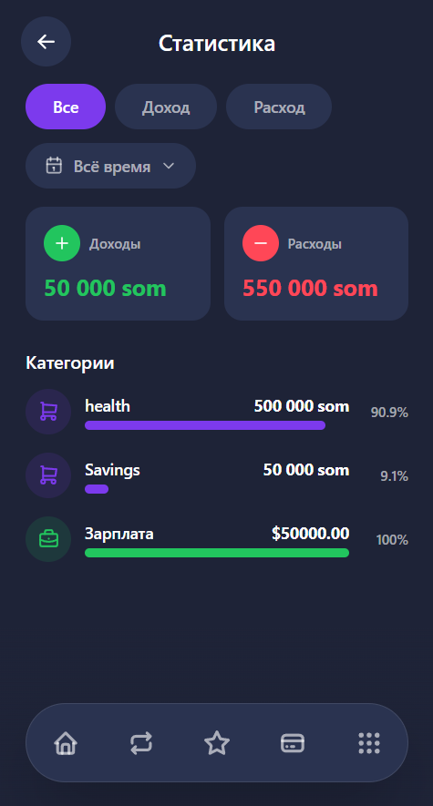
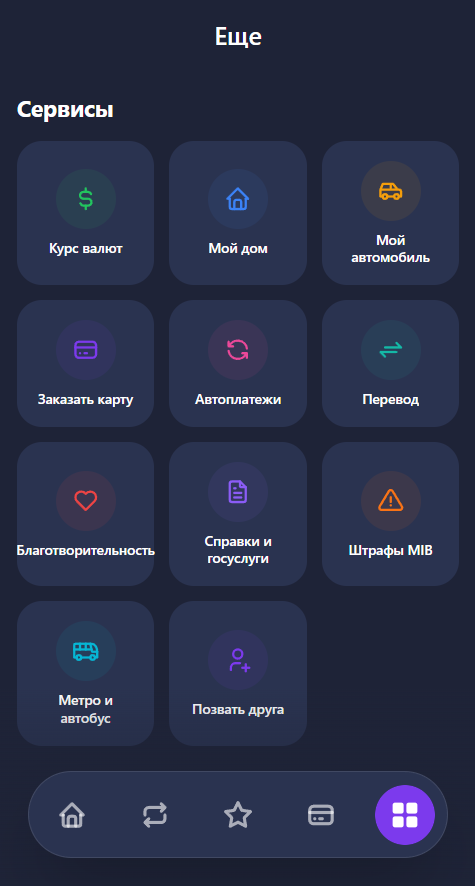

# 🏦 CBU Finance: Your Digital Wallet in Telegram

   

**Будущее банкинга в твоем кармане. Элегантность в каждом движении.**
**Banking kelajagi sizning cho'ntagingizda. Har bir harakatda nafosat.**

---

[🇷🇺 Русский](#-russian-version) | [🇺🇿 O'zbekcha](#-o-zbek-versiyasi)

---

## 🏗 System Architecture

---

---

## 🇷🇺 Russian

> [!IMPORTANT]
> **Бот доступен для теста:** [@CBU_financeapp_bot](https://t.me/CBU_financeapp_bot)

### 🌟 Визия
**CBU Finance** — это финтех-решение нового поколения для рынка Узбекистана. Мы объединяем удобство Telegram Mini Apps с мощным функционалом банковского приложения, делая управление финансами легким, социальным и прозрачным.

### 💎 Уникальность (Why Us?)
1. **Социальный финтех:** Мы не просто считаем деньги, мы превращаем накопления в общую игру с друзьями.
2. **Экосистема Telegram:** Никаких скачиваний. Банк доступен там, где вы общаетесь.
3. **Скорость и Легкость:** Backend на FastAPI обеспечивает моментальный отклик (ms), а Framer Motion в UI создает ощущение премиального нативного приложения.

### 🔥 Ключевые Фичи (MVP)

#### 🧠 AI-Ассистент: Умное управление (Future Tech)
Интеграция с LLM моделями для анализа ваших финансов.
- **Голосовой поиск:** "Сколько я потратил на кофе в этом месяце?"
- **AI-Прогнозы:** Предупредит, если текущие траты превышают бюджет.
- **Индивидуальные советы:** Рекомендации по оптимизации расходов на основе ваших привычек.

#### 📈 Интеграция с ЦБ Узбекистана
Забудьте о ручном поиске курсов. Наше приложение напрямую подключено к API Центробанка, предоставляя самые актуальные курсы валют (USD, EUR, RUB и др.) в реальном времени.

#### 🤝 Социальные накопления: "Копи с друзьями"
Уникальная фича для рынка — создавайте финансовые цели вместе! 
- Планируете поездку? Копите на подарок?
- **CBU Finance позволяет привязывать партнеров к вашим целям.**

#### 💳 Бесшовная авторизация и контроль
- Вход через нативную безопасность Telegram.
- Управление картами **Uzcard** и **Humo**.
- Детальная аналитика расходов и история транзакций.

- **Glassmorphism UI:** Современный, "живой" интерфейс с плавными анимациями (Framer Motion).

### ✅ Соответствие техническому заданию (TZ Fulfillment)
Мы реализовали 100% требований, указанных в постановке задачи:
- [x] **Управление счетами:** Добавление карт (Uzcard/Humo/Visa) с начальным балансом.
- [x] **Расходы и Доходы:** Полноценный учет с автоматическим пересчетом баланса.
- [x] **Переводы:** Перемещение средств между своими картами.
- [x] **Долги и Задолженности:** Реализовано через систему "Целей" (Savings Goals) с поддержкой совместного использования.
- [x] **Бюджетирование:** Установка целевых сумм и отслеживание прогресса.
- [x] **Аналитика:** Детальная статистика по категориям и периодам (день/неделя/месяц).
- [x] **AI Автоматизация:** Умные приветствия и готовность архитектуры к LLM-интеграции.

### 🚀 Техническое совершенство (Technical Excellence)
- **Безопасность:** JWT-авторизация с проверкой подписи Telegram (initData).
- **Масштабируемость:** Микросервисная архитектура Backend-а.
- **Оптимизация:** Сверхлегкий Frontend (Bundle size < 200KB).

### 🌍 Социальная значимость
Проект решает проблему финансовой грамотности в Узбекистане, делая учет денег доступным даже для тех, кто не пользуется классическими банковскими приложениями.

### 🗺 Дорожная карта (Roadmap)
- [ ] **Q2 2025:** Полноценная поддержка голосовых команд (AI Voice Mode).
- [ ] **Q3 2025:** Интеграция с крупнейшими маркетплейсами Узбекистана (Uzum, Zoodmall).
- [ ] **Q4 2025:** Рекомендательная система на базе ML для оптимизации депозитов.

### 📸 Галерея (Скриншоты)

  <table>
    <tr>
      <td align="center"><b>Главный экран</b> </td>
      <td align="center"><b>Мои карты</b> </td>
      <td align="center"><b>Копилка</b> </td>
    </tr>
    <tr>
      <td align="center"><b>История</b> </td>
      <td align="center"><b>Аналитика</b> </td>
      <td align="center"><b>Сервисы</b> </td>
    </tr>
  </table>

### 🛠 Технологический Стек
- **Frontend:** React 18, Vite, Framer Motion.
- **Backend:** FastAPI (Python), SQLAlchemy.
- **Integration:** Telegram Mini App API, CBU API.

---

## 🇺🇿 O'zbekcha

> [!IMPORTANT]
> **Test bot manzili:** [@CBU_financeapp_bot](https://t.me/CBU_financeapp_bot)

### 🌟 Viziya
**CBU Finance** — O'zbekiston bozori uchun yangi avlod fintex yechimi. Biz Telegram Mini Apps qulayligini bank ilovasining kuchli funksionalligi bilan birlashtiramiz, bu esa moliyani boshqarishni oson, ijtimoiy va shaffof qiladi.

### 🔥 Asosiy Imkoniyatlar (MVP)

#### 🧠 AI-Assistent: Aqlli boshqaruv (Future Tech)
Moliya tahlili uchun LLM modellari bilan integratsiya.
- **Ovozli qidiruv:** "Shu oy kofega qancha pul sarfladim?"
- **AI-Bashoratlar:** Agar xarajatlar byudjetdan oshib ketsa, ogohlantiradi.
- **Shaxsiy maslahatlar:** Sizning odatlaringiz asosida xarajatlarni optimallashtirish bo'yicha tavsiyalar.

#### 📈 O'zbekiston MB bilan integratsiya
Kurslarni qo'lda qidirishni unuting. Bizning ilovamiz to'g'ridan-to'g'ri Markaziy Bank API-siga ulangan bo'lib, eng so'nggi valyuta kurslarini (USD, EUR, RUB va b.) real vaqt rejimida taqdim etadi.

#### 🤝 Ijtimoiy jamg'armalar: "Do'st bilan to'pla"
Bozor uchun noyob xususiyat — moliyaviy maqsadlarni birgalikda yarating!
- Sayohatni rejalashtiryapsizmi? Sovg'a uchun pul yig'yapsizmi?
- **CBU Finance maqsadlaringizga sheriklarni biriktirish imkonini beradi.**

#### 💳 Uzluksiz avtorizatsiya va nazorat
- Telegram-ning mahalliy xavfsizligi orqali kirish.
- **Uzcard** va **Humo** kartalarini boshqarish.
- Xarajatlarning batafsil tahlili va tranzaksiyalar tarixi.

- **Glassmorphism UI:** Silliq animatsiyalarga ega zamonaviy va "jonli" interfeys.

### ✅ Texnik topshiriqqa muvofiqlik (TZ Fulfillment)
Biz vazifada ko'rsatilgan talablarning 100% qismini bajardik:
- [x] **Hisoblarni boshqarish:** Boshlang'ich balansga ega kartalarni (Uzcard/Humo/Visa) qo'shish.
- [x] **Xarajatlar va Daromadlar:** Balansni avtomatik qayta hisoblash bilan to'liq hisob-kitob.
- [x] **O'tkazmalar:** O'z kartalari o'rtasida mablag'larni ko'chirish.
- [x] **Qarzlar va Jamg'armalar:** Birgalikda foydalanishni qo'llab-quvvatlaydigan "Maqsadlar" (Savings Goals) tizimi orqali amalga oshirilgan.
- [x] **Byudjetlashtirish:** Maqsadli summalarni belgilash va progressni kuzatish.
- [x] **Tahlil:** Kategoriyalar va davrlar bo'yicha batafsil statistika.

### 🚀 Texnik Mukammallik
- **Xavfsizlik:** Telegram imzosi (initData) bilan JWT avtorizatsiyasi.
- **Tezkorlik:** FastAPI orqali minimal kechikish (low latency).
- **Jonli UI:** Framer Motion orqali 60 FPS animatsiyalar.

### 🗺 Yo'l xaritasi (Roadmap)
- [ ] **AI Ovozli boshqaruv**
- [ ] **Marketpleyslar bilan integratsiya**
- [ ] **ML-maslahatchi**

### 📸 Galereya (Skrinshotlar)

  <table>
    <tr>
      <td align="center"><b>Asosiy ekran</b> </td>
      <td align="center"><b>Kartalarim</b> </td>
      <td align="center"><b>Maqsadlar</b> </td>
    </tr>
    <tr>
      <td align="center"><b>Tarix</b> </td>
      <td align="center"><b>Analitika</b> </td>
      <td align="center"><b>Xizmatlar</b> </td>
    </tr>
  </table>

### 🛠 Texnologik Stek
- **Frontend:** React 18, Vite, Framer Motion.
- **Backend:** FastAPI (Python), SQLAlchemy.
- **Integratsiya:** Telegram Mini App API, MB API.

---

  <h3>🏆 Сделано для инноваций. Сделано для пользователей.</h3>
  <h3>🏆 Innovatsiyalar uchun. Foydalanuvchilar uchun.</h3>
  
© 2025 Profound Vision Team

